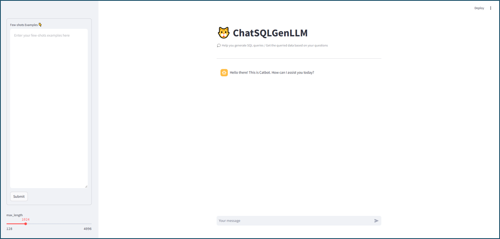

# ChatSQLGenLLM
A chatbot to generate SQL code / Get the queried data based on LLM model



&nbsp;

## Model Used:
**SQLCoder** Model from Huggingface. Details: https://huggingface.co/defog/sqlcoder-7b-2

If you want to use this model, you could download all files on this page https://huggingface.co/defog/sqlcoder-7b-2/tree/main to your local folder, and set it as the `model_path` when running the code.

&nbsp;

## Interface Builder:
**Streamlit**. Details: https://streamlit.io/

&nbsp;

## Basic Information of System:
- Python 3.9
- Unbantu 20.4
- Cuda Version 11.4
- GPU RAM: 16G * 2GPU
- Basic Python Package: `streamlit`, `transformers`, `torch`, `fastapi`, `sqlite3`, `pandas`

&nbsp;

## Contents of this repository
 Please kindly support if you think this repo is helpful! Thx!

&nbsp;

### 1. locally_hosted_llm_directly_with_streamlit
Codes for you to direcly use Streamlit module to build a chatbot. Quick and Easy!

- **Step 1: Adjust configurations in `config.json`**
    - `model_path`: path of local LLM model.
    - `prompt_file`: path of prompt template markdown file. The template in this repo is based on SQLCoder model, if you want to use another model, you may need to change the template.
    - `metadata_file`: path of SQL database's metadata (table name, column names, and column types). The current metadata file in this repo is just a placeholder, you may need to change it to your own metadata.
    - `answer_mode`:
        - "code": the chatbot will answer you with the SQL query code.
        - "dataframe": the chat will answer you with the queried dataframe (connected database is required).
    - `local_db_path`: only use when you want it to answer with "dataframe" and have a local database, otherwise you should leave it as empty.

- **Step 2: Use your browser and start to chat**
    - (1) Run the following command in terminal and start Streamlit service:
        ```bash
        streamlit run run_streamlit.py --server.address 127.0.0.1 --server.port 6006
        ```
    - (2) Open your brower: http://127.0.0.1:6006
        - Note: if you are using a server and want to open the browser locally, make sure you have the port forwarded. And of course, you can use other port instead of 6006.

&nbsp;

### 2. locally_hosted_llm_fastapi_with_streamlit
Codes for you to build a local LLM api and use Streamlit to call the api: more flexible and no need to re-load LLM even if you end the Streamlit service, also provide possibility for you to utilize other tools you like other than Streamlit to implement the LLM model.

- **Step 1: Adjust configurations in `config.json`**
    - `model_path`: path of local LLM model.
    - `prompt_file`: path of prompt template markdown file. The template in this repo is based on SQLCoder model, if you want to use another model, you may need to change the template.
    - `metadata_file`: path of SQL database's metadata (table name, column names, and column types). The current metadata file in this repo is just a placeholder, you may need to change it to your own metadata.
    - `answer_mode`:
        - "code": the chatbot will answer you with the SQL query code.
        - "dataframe": the chat will answer you with the queried dataframe (connected database is required).
    - `local_db_path`: only use when you want it to answer with "dataframe" and have a local database, otherwise you should leave it as empty.
    - `api_address`: the local api address of the LLM model, only the "port" number matters.

- **Step 2: Start the API service**
    - Start the API on the background:
        ```bash
        uvicorn s1_build_local_api:app --host 0.0.0.0 --port 8000 > uvicorn.log 2>&1 &
        ```
        - Note: the port you use here shall be aligned with the `api_address` in `config.json`.
- **Step 3: Use your browser and start to chat**
    - (1) Start the Streamlit service:
        ```bash
        streamlit run s2_chatbot_call_api.py --server.address 127.0.0.1 --server.port 6006
        ```
    - (2) Open your brower: http://127.0.0.1:6006
        - Note: if you are using a server and want to open the browser locally, make sure you have the port forwarded. And of course, you can use other port instead of 6006.
- **Step 4: Stop the API service**
    - Stop the API:
        ```bash
        lsof -ti:8000 | xargs kill
        ```
        - Note: the port here is the same in the Step 2.